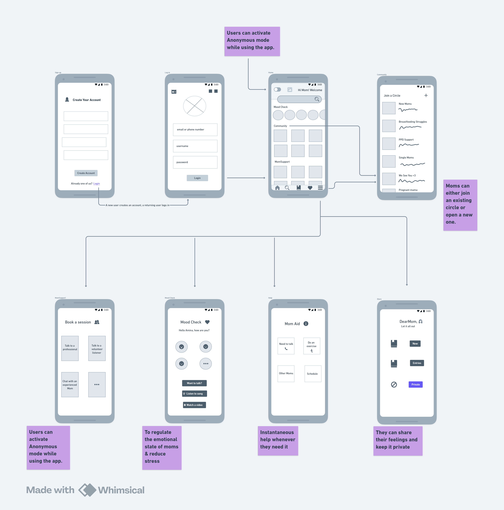

# MyWoman

## What the product does
MyWoman is an online platform designed to support new mothers facing postpartum depression. It gives them a safe space to connect with other moms, share experiences, and seek emotional help through easy-to-use features and professional support.

## Why it matters
Every year, many new mothers silently struggle with depression and anxiety after childbirth. MyWoman creates a community where they can talk freely, feel understood, and find comfort in knowing they’re not alone, thanks to its supportive community and access to professional counselling. 

## Who it is for
MyWoman is built for:
- New mothers experiencing postpartum depression or loneliness.
- Experienced mothers who want to support others.
- Mental health volunteers and professionals offering guidance and counselling.

## Key features
- **Community Circles:** Join or create groups to connect with other mothers.
- **MomSupport:** Book sessions with professionals, volunteer listeners, or experienced moms.
- **Mood Check:** Reflect on daily emotions and receive personalized tips.
- **MomAid:** Find support, calming exercises, and tips to help you through tough moments.
- **DearMom (Diary):** Write private journal entries and track mental health progress.
- **Anonymous Mode:** Choose to stay unidentified while sharing experiences.

## Technologies Used
- **Frontend:** React Native (for mobile interface)
- **Backend:** Node.js with Express (for handling user requests)
- **Database:** Firebase (for real-time storage and authentication)
- **Authentication:** Firebase Auth (for secure sign-ins)
- **File Storage:** Firebase Storage (for user uploads and diary entries)
- **Cloud Services:** Google Cloud for hosting and notifications

## Vision
To build a warm, safe, and inclusive space where mothers can freely express their feelings and receive the emotional support they need.
